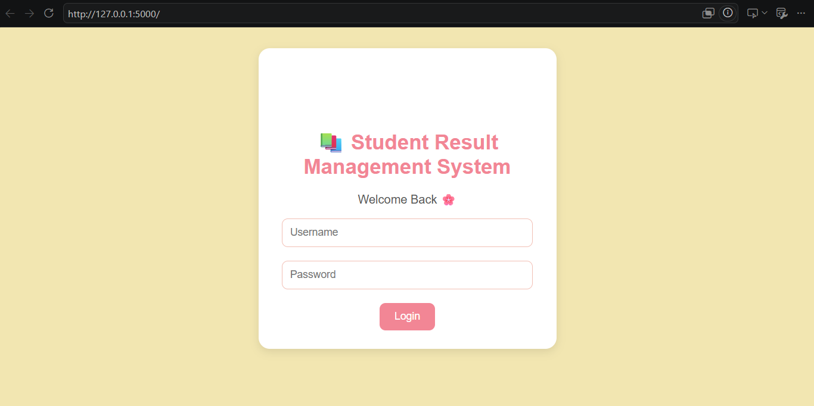
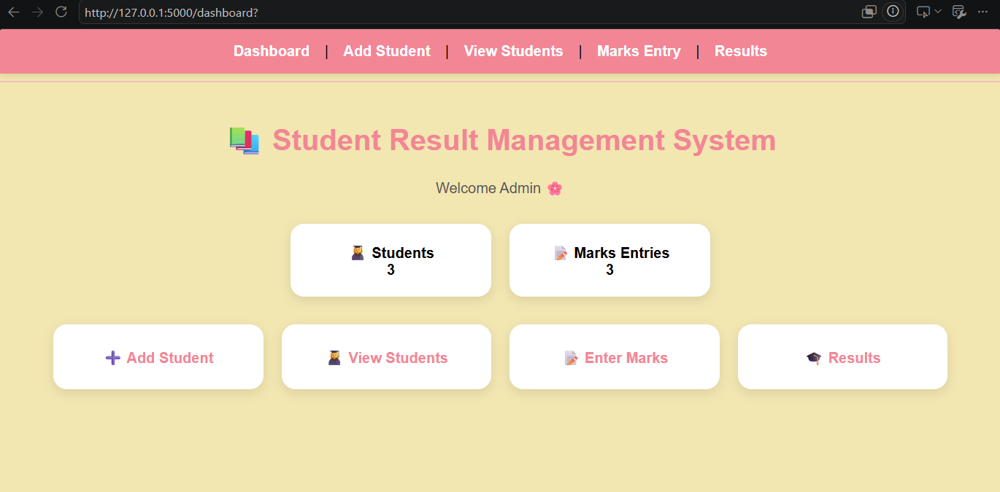
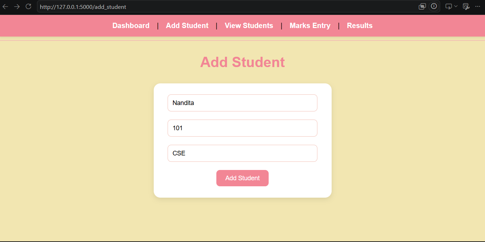
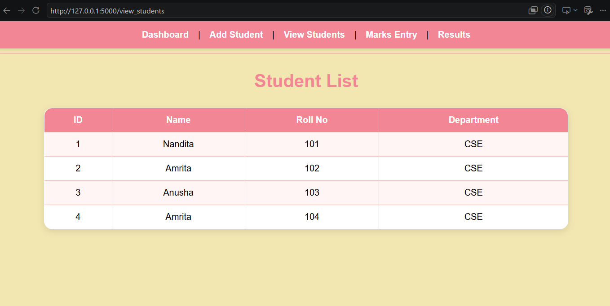
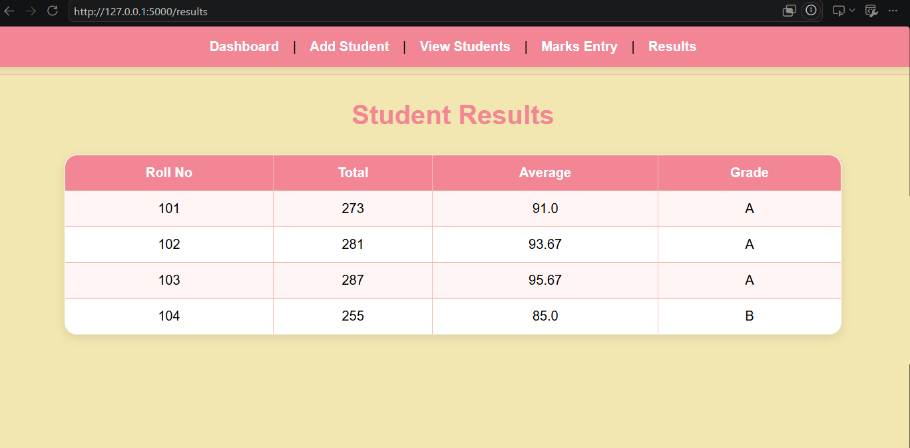

# 📚 Student Result Management System

A web-based Student Result Management System developed using **Python Flask, SQLite, HTML, and CSS**. The application allows administrators to manage student records, enter marks, and automatically calculate grades based on academic performance.

---

## ✨ Features

* Student Login Interface
* Dashboard Navigation
* Add Student Records
* View Student Details
* Enter Subject Marks
* Automated Grade Calculation
* Result Management
* SQLite Database Integration
* User-Friendly Interface

---

## 🛠️ Technologies Used

* Python
* Flask
* SQLite
* HTML
* CSS
* Git
* GitHub

---

## 📸 Screenshots

### Login Page

### Dashboard

### Add Student

### View Students

### Results Page

---

## 📂 Project Structure

student-result-management-system/

├── app.py

├── create_db.py

├── create_marks_table.py

├── students.db

│

├── screenshots/

│ ├── login.png

│ ├── dashboard.png

│ ├── add_student.png

│ ├── list.png

│ └── result.png

│

├── static/

│ └── style.css

│

├── templates/

│ ├── login.html

│ ├── dashboard.html

│ ├── navbar.html

│ ├── add_student.html

│ ├── view_students.html

│ ├── marks_entry.html

│ └── results.html

│

└── README.md

---

## 🚀 How to Run

### 1. Clone the Repository

git clone https://github.com/Nanditacodes29/student-result-management-system.git

### 2. Navigate to the Project Directory

cd student-result-management-system

### 3. Create a Virtual Environment

python -m venv venv

### 4. Activate the Virtual Environment (Windows)

venv\Scripts\activate

### 5. Install Flask

pip install flask

### 6. Create the Database

python create_db.py

python create_marks_table.py

### 7. Run the Application

python app.py

### 8. Open in Browser

http://127.0.0.1:5000

---

## 🎯 Future Improvements

* User Authentication System
* Edit Student Records
* Delete Student Records
* Search Functionality
* Export Results as PDF
* Responsive Mobile Design

---

## 👩‍💻 Author

**Nandita Gaur**

B.Tech CSE (Blockchain Technology)

VIT Vellore

---

